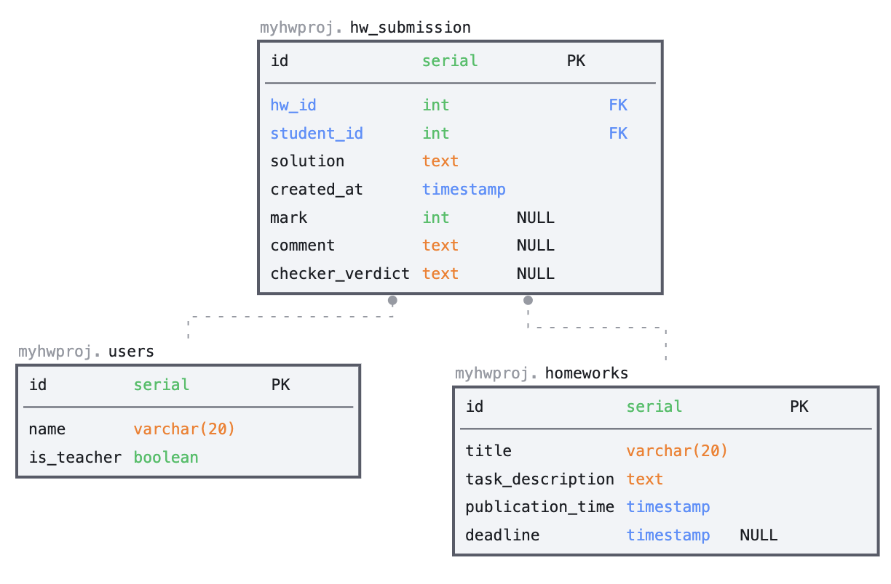

# HWProj

## Инструкция по запуску

Запуск сервера вместе с базой данных и раннером происходит при помощи `docker compose`

```bash
sudo docker compose build
sudo docker compose up
```

Для запуска клиента необходимо установить фреймворк [node.js](https://nodejs.org/en/).
```bash
cd web-client
npm install
np run serve -- --port 4000
```
Порт нужно указать обязательно, так как порт по умолчанию уже будет занят сервером. Можно указать любой свободный порт.

## Архитектура

<p align="center">
  
</p>

Архитектура реализует стиль Web-queue-worker. 3 главных блока: Client, Web Server и Runner

* **Client**: веб-приложение с которым будет взаимодействовать пользователь.
* **Web Server**: backend приложения. 
* **Message Queue**: брокер сообщений; очередь, в которую сервер отсылает события типа "Проверить присланное ДЗ".
* **Handler**: отдельное приложение, вычитывающее события из **Message Queue** и выполняющее их проверку.
* **Database**: база даннных приложения.

### Database Structure

<p align="center">
  
</p>

### Web Server

<p align="center">
  
</p>

Архитектура Веб-Сервера предоставляет REST API для различных запросов к базе данных. 
Предполагается использование [Spring Framework](https://spring.io/). Запрос сначала поступает в контроллер,
далее обрабатывается одним из сервисов, который обращается к базе данных при помощи соответствующих репозиториев.


* **User**, **Homework**, **HwSubmission**: сущности(`@Entity`), которые являются представлением соответсвующих таблиц из базы данных.
* **HwController**: REST контроллер, каждый метод которого представляет собой некий REST запрос.
* **HwSubmissionService**: Сервис для обработки запросов, связанных с сущностью `HwSubmission`. Также отправляет на проверку решения раннеру при помощи `RabbitRepository`.
* **HomeworkService**: сервис для обработки запросов, связанных с сущностью `Homework`. 
* **HomeworkRepository**, **HwSubmissionRepository**: репозитории, с помощью которых осуществляется доступ к соответсвутвующим таблицам в базе данных.
* **RabbitService**: отправляет решение домашней работы в очередь на проверку.

### Runner

<p align="center">
  
</p>

Раннер - микросервис с трёхуровневой архитектурой, предназначенный для проверки домашних работ.

* **RabbitController**: контроллер, вычитывающий очередь брокера сообщений.
* **RabbitService**: сервисный слой бизнес-логики, на котором выполняется проверка домашней работы.
* **SubmissionChecker**: интерфейс для проверки домашней работы.
* **GithubSubmissionChecker**: реализация интерфейса **SubmissionChecker** для проверки загруженных на Github решений.
* **HwSubmissionRabbitRepository**: абстракция для работы взаимодействия с СУБД, выставляет вердикт в посылки на основе проверки.

## Технологии

* **Spring Framework** - универсальный фреймворк для написания серверной части приложения на Java. Подробная документация, широкое комьюнити, сопоставимых аналогов нет.
* **PostgreSQL**: многофункциональная СУБД, команда имеет опыт использования.
* **RabbitMQ**: брокер сообщений, использует push модель передачи сообщений, что позволяет самостоятельно балансировать нагрузку между получателями по сравнению с Kafka. Также в нашем случае "1 producer, 1 consumer" использование Kafka - оверхед. 
* **Vue.js**: веб-фреймворк для создания пользовательских интерфейсов клиента. Команда знакома с данным фреймворком. 

## Koманда
* [Владимир Федоров](@readrid)
* [Илья Смирнов](@smirok)
* [Никита Усольцев](@usoltsev37)
